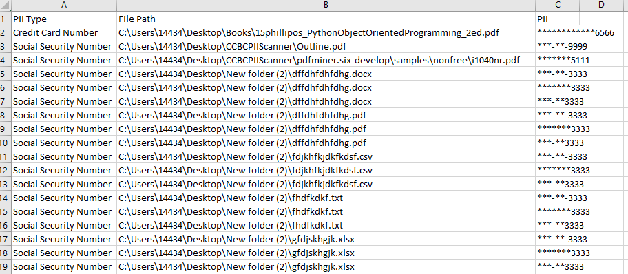

# Lightweight Script for Finding Personal Identifiable Information
Found a compromised host on your network?
Need to report to your higher ups whether PII was potentially stolen?

This script is for you.

__Installation__

Download and extract the PIIScanner zip file.

Install the requirements:

```powershell
pip install -r requirements.txt
```
__Running__

python .\PIIScanner.py (Path you Wish to Scan) (Output CSV File)

Example:

```powershell
python .\PIIScanner.py C:\Users\14434\Desktop\ output.csv
```

If PII is detected, the output CSV file will be created.




